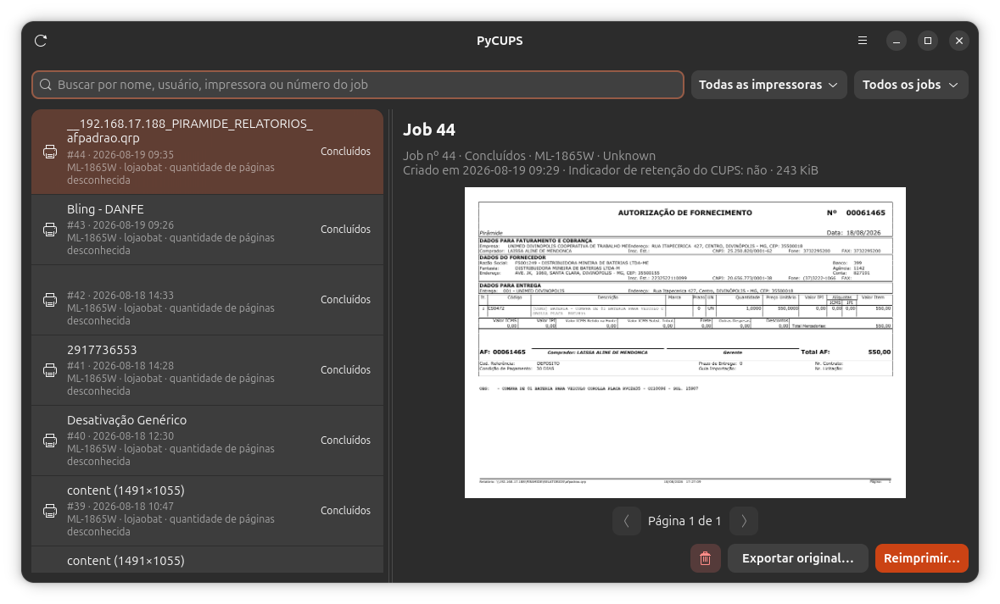
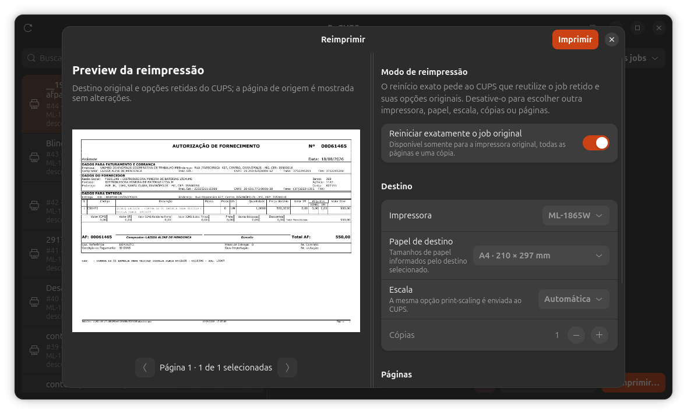
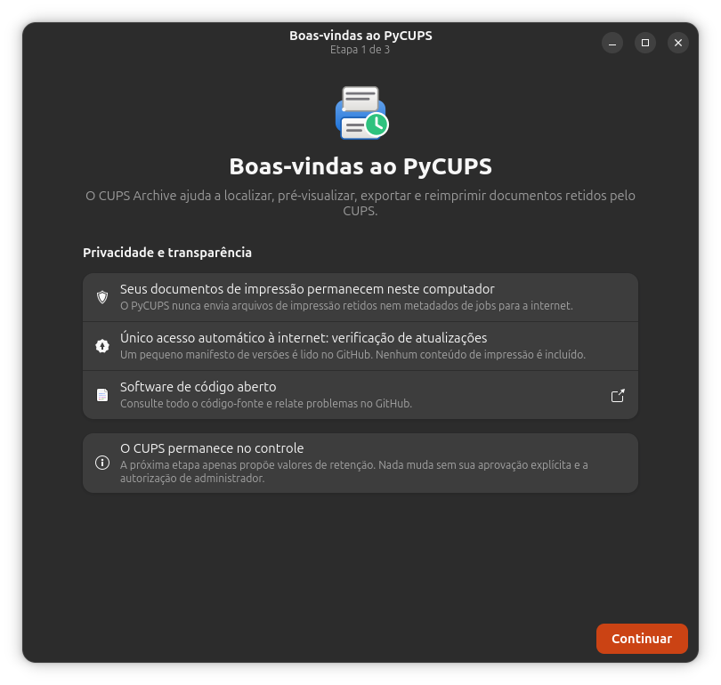
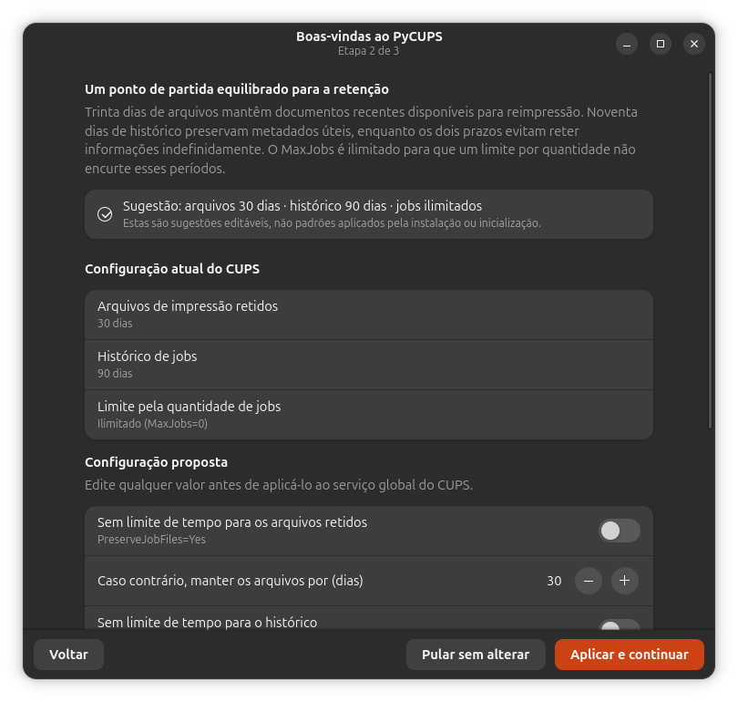
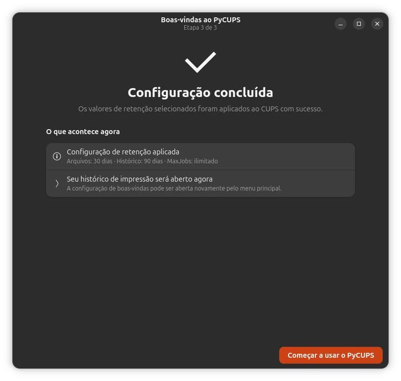
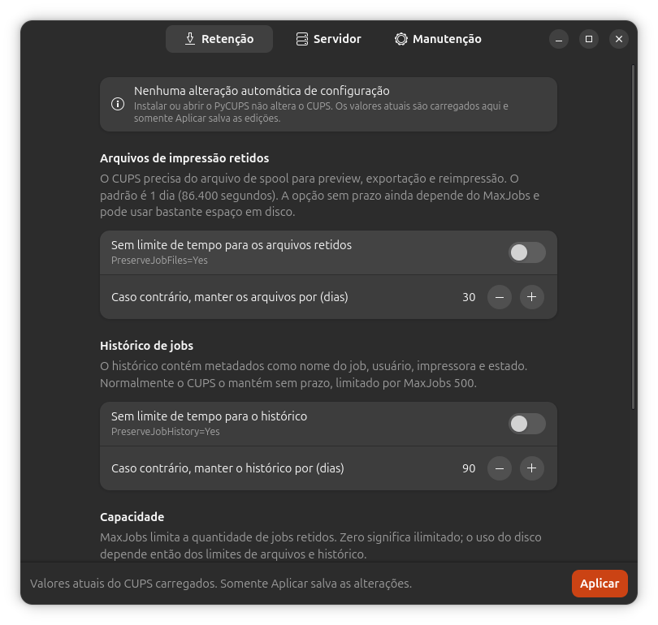
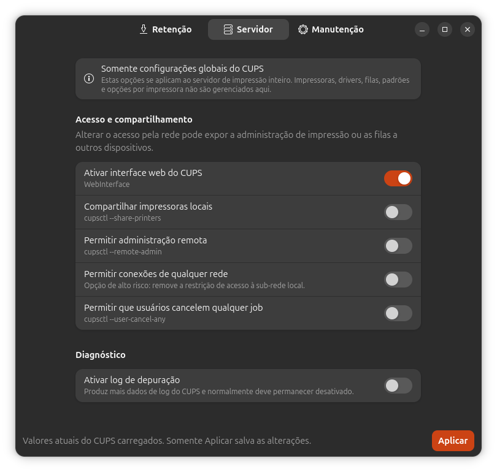
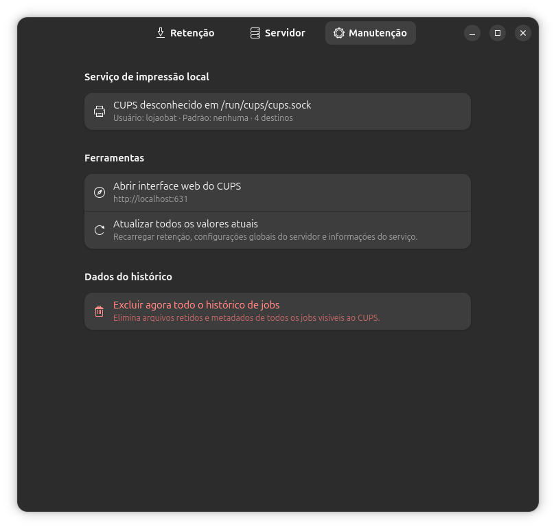

<div align="center">
  
  <h1>PyCUPS</h1>
  <p><strong>Seu histórico local de impressões do CUPS, pronto para visualizar, exportar e reimprimir.</strong></p>
  <p>Um aplicativo GTK 4 e Libadwaita para Linux, voltado à privacidade e aos trabalhos de impressão retidos.</p>
  <p>
    <a href="README.md">English</a>
    ·
    <a href="https://github.com/ehstbr/PyCUPS/releases/latest">Versão mais recente</a>
    ·
    <a href="https://github.com/ehstbr/PyCUPS/issues">Relatar um problema</a>
    ·
    <a href="CHANGELOG.md">Histórico de alterações</a>
  </p>
  <p>
    
    
    
    
    
    
    
  </p>
</div>

<p align="center">
  
</p>

## Um arquivo de impressões do CUPS integrado ao desktop Linux

O **PyCUPS — CUPS Archive** transforma os jobs já retidos pelo serviço CUPS
local em um histórico prático no desktop. Pesquise impressões anteriores,
consulte seus metadados, visualize documentos preservados, exporte o arquivo
original, reinicie exatamente o mesmo job ou crie uma nova reimpressão de PDF
com páginas selecionadas.

Ele foi pensado para Ubuntu e outros sistemas GNOME baseados em Debian e usa os
componentes da própria plataforma: Python, GTK 4, Libadwaita, bindings PyCUPS
do sistema, IPP, Poppler e PolicyKit. O aplicativo não cria um arquivo na nuvem
e não lê diretamente a pasta privada de spool do CUPS.

> [!IMPORTANT]
> O PyCUPS só consegue visualizar, exportar ou reimprimir enquanto o CUPS ainda
> possuir o arquivo retido daquele job. Instalar o aplicativo não recupera
> arquivos que o CUPS já expirou ou eliminou.

## Em quais situações o PyCUPS pode ser útil

O PyCUPS é especialmente útil para:

- **Reimprimir nota fiscal, recibo, etiqueta de envio, relatório ou formulário**
  depois que o programa ou a aba do navegador original já foi fechada.
- **Recuperar uma impressão recente após atolamento, folha danificada, bandeja
  errada ou interrupção**, desde que o arquivo tenha sido retido pelo CUPS.
- **Descobrir quem imprimiu, o que foi impresso e em qual impressora**,
  pesquisando título, usuário, destino, estado, data ou número do job.
- **Exportar o documento de origem retido** antes que ele expire no serviço de
  impressão.
- **Reimprimir apenas algumas páginas de um PDF**, como `1,4,7-10`, sem reabrir
  ou recriar o documento original.
- **Enviar um PDF antigo para outra impressora, papel, escala ou quantidade de
  cópias** e conferir antes um preview da folha calculado a partir do IPP.
- **Reiniciar exatamente dados brutos ou de impressora térmica** como foram
  recebidos pelo CUPS, quando o job original ainda estiver disponível.
- **Manter um histórico local e controlado em lojas, expedições, logística,
  áreas administrativas, escolas, laboratórios, suporte e pequenos escritórios**
  sem enviar documentos a terceiros.
- **Equilibrar recuperação e privacidade**, definindo prazos separados para os
  arquivos de impressão e seus metadados.

## Principais recursos

| Área | O que o PyCUPS oferece |
| --- | --- |
| Histórico | Lista atualizada do CUPS, busca, filtros por estado e seleção de todas, uma ou várias impressoras |
| Preview | Páginas de PDF, imagens e textos; zoom, roda do mouse, 100%, ajustar à janela, rotação, barras e arraste |
| Reimpressão | Reinício exato do CUPS ou novo PDF com intervalos de páginas, destino, papel, escala e cópias |
| Exportação | Salva o documento original retido por meio da API autorizada do CUPS |
| Retenção | Valores editáveis para arquivos, histórico e `MaxJobs`, com autorização explícita pelo PolicyKit |
| Servidor | Pequeno conjunto limitado de opções globais do CUPS, sem gerenciar impressoras ou drivers |
| Segurança | Confirmação para ações destrutivas e verificação bloqueante após o reinício do CUPS |
| Privacidade | Documentos locais, sem telemetria, analytics, nuvem ou armazenamento da senha do CUPS |
| Atualizações | Manifesto validado no GitHub, com atualizações opcionais e obrigatórias |
| Idiomas | Interface-base em inglês e tradução completa para português do Brasil |

## Capturas de tela

### Reimpressão com preview realista do papel de destino

<p align="center">
  
</p>

O preview da reimpressão é propositalmente diferente do visualizador principal.
Na tela principal, uma página pode ser girada e ampliada para facilitar a
leitura. No diálogo de reimpressão, o preview representa o resultado físico
calculado para impressora, papel, margens imprimíveis, orientação e escala.

<details>
<summary><strong>Assistente inicial de privacidade e retenção</strong></summary>
<br>
<table>
  <tr>
    <td width="33%" align="center"><strong>Privacidade primeiro</strong><br></td>
    <td width="33%" align="center"><strong>Proposta editável</strong><br></td>
    <td width="33%" align="center"><strong>Conclusão clara</strong><br></td>
  </tr>
</table>
</details>

<details>
<summary><strong>Configurações globais do CUPS e manutenção</strong></summary>
<br>
<table>
  <tr>
    <td width="33%" align="center"><strong>Retenção</strong><br></td>
    <td width="33%" align="center"><strong>Servidor</strong><br></td>
    <td width="33%" align="center"><strong>Manutenção</strong><br></td>
  </tr>
</table>
</details>

## Como funciona


O PyCUPS solicita metadados e documentos retidos por operações PyCUPS/IPP. O
CUPS continua sendo a fonte de verdade e controla permissões, disponibilidade
dos arquivos, retenção e o comportamento do reinício exato.

### Histórico não é a mesma coisa que documento retido

| Dado do CUPS | O que permite exibir | É necessário para preview/exportação/reimpressão |
| --- | --- | --- |
| Histórico do job | Nome, usuário, impressora, estado, data, tamanho e número | Não |
| Arquivo de spool retido | O documento imprimível preservado pelo CUPS | Sim |

Por isso, um job pode continuar visível depois que seu arquivo imprimível
expirar. O PyCUPS mostra essa diferença em vez de prometer uma recuperação
quando restarem apenas metadados.

## Instalação

### Pacote Debian — recomendado

Baixe o `.deb` na
[versão mais recente](https://github.com/ehstbr/PyCUPS/releases/latest) e use o
APT para resolver automaticamente as dependências do sistema:

```bash
cd ~/Downloads
sudo apt update
sudo apt install ./print-archive_0.1.11_all.deb
```

Abra **PyCUPS** na grade de aplicativos ou execute:

```bash
print-archive
```

O pacote Debian e o comando internos conservam o nome histórico
`print-archive`. Assim, a atualização das versões anteriores mantém o mesmo
aplicativo instalado, as preferências e a identidade do lançador.

### ZIP do código-fonte

Instale primeiro as dependências:

```bash
sudo apt update
sudo apt install \
  python3 python3-gi python3-cups python3-pypdf \
  gir1.2-gtk-4.0 gir1.2-adw-1 gir1.2-gdkpixbuf-2.0 \
  gir1.2-soup-3.0 poppler-utils cups-client cups-daemon \
  pkexec gettext
```

Depois, extraia e execute o pacote-fonte publicado no GitHub:

```bash
unzip PyCUPS-0.1.11.zip
cd PyCUPS-0.1.11
./run.sh
```

O `run.sh` usa o Python e os pacotes GI da distribuição. Ele não cria ambiente
virtual nem baixa dependências da internet.

## Primeira execução e retenção sugerida para o CUPS

O assistente em três etapas explica a privacidade, lê os valores reais do CUPS
e oferece um ponto de partida editável:

| Diretiva do CUPS | Valor sugerido | Finalidade |
| --- | ---: | --- |
| `PreserveJobFiles` | `2592000` | Mantém os arquivos reimprimíveis por 30 dias |
| `PreserveJobHistory` | `7776000` | Mantém os metadados dos jobs por 90 dias |
| `MaxJobs` | `0` | Evita que um limite por quantidade encurte os dois prazos |

Esses valores **nunca são aplicados pela instalação, atualização,
inicialização ou simples navegação**. É necessário pressionar **Aplicar e
continuar** e autorizar a alteração pelo PolicyKit. **Pular sem alterar**
preserva exatamente a configuração existente do CUPS.

Somente um indicador de onboarding concluído é salvo na pasta de configuração
XDG do usuário, normalmente `~/.config/pycups/state.json`. Esse arquivo não
contém documentos, metadados, valores do CUPS, usuário ou senha.

Após salvar a retenção ou as opções de servidor, todo o aplicativo permanece
bloqueado pelo diálogo **Reiniciando CUPS…**. O PyCUPS cria novas conexões IPP
e exige respostas consecutivas antes de liberar a interface e recarregar o
histórico. Os botões ao fundo conservam seus textos normais; o diálogo modal é
a única fonte de informação sobre o andamento.

## Controles do preview

O visualizador principal possui:

- botões para reduzir e ampliar;
- controle editável de 1% a 500%;
- zoom pela roda do mouse enquanto o ponteiro estiver sobre o preview;
- ajuste à janela e tamanho real de 100%;
- rotação visual para esquerda ou direita em intervalos de 90 graus;
- barras de rolagem e navegação por arraste quando a página ultrapassar a área.

A rotação altera somente o que aparece na tela. Ela não modifica o arquivo
retido nem a orientação física de uma reimpressão.

## Reinício exato e reimpressão flexível de PDF

- **Reinício exato:** o CUPS reinicia todas as páginas, uma cópia, na impressora
  original e reutiliza os atributos retidos.
- **Reimpressão flexível:** o PyCUPS cria um novo job para páginas selecionadas,
  outra impressora, papel, escala ou número de cópias.
- **Preview da folha:** o aplicativo monta uma aproximação usando dimensões de
  mídia, margens imprimíveis e `print-scaling` informados pelo IPP. O driver ou
  o equipamento ainda podem realizar transformações próprias.
- **Formatos brutos e térmicos:** quando retidos, podem ser reiniciados
  exatamente, mas não são renderizados nem divididos em páginas.
- **Vários documentos:** jobs compostos somente por PDFs são unidos na ordem.
  Formatos mistos permanecem limitados ao reinício exato.

Exemplo para um PDF retido com dez páginas:

1. Selecione o job e aguarde seu preview.
2. Clique em **Reimprimir**.
3. Desative **Reiniciar exatamente o job original** e **Imprimir todas as páginas**.
4. Digite `4` para uma página ou `1,4,7-10` para seis páginas.
5. Escolha destino, papel, escala e cópias, confira o preview e clique em
   **Imprimir**.

Os subconjuntos de páginas e as imagens de preview ficam em um diretório
temporário privado por processo (`0700`); os arquivos usam modo `0600` e tudo é
removido quando o PyCUPS é encerrado.

## Permissões, segurança e privacidade

- Documentos retidos e metadados permanecem no computador que executa o CUPS.
- Não há telemetria, publicidade, analytics, arquivo na nuvem ou envio
  automático de falhas.
- A única requisição automática à internet lê o pequeno manifesto
  `version.json` deste repositório no GitHub.
- O PyCUPS usa operações autorizadas do CUPS, sem enfraquecer as permissões de
  `/var/spool/cups`.
- Quando o CUPS solicita usuário e senha, a senha é limpa depois da requisição
  e nunca é persistida pelo aplicativo.
- Alterações globais usam o auxiliar limitado e protegido
  `/usr/lib/print-archive/apply-settings` com uma solicitação nativa do PolicyKit.
- A exclusão individual ou completa do histórico sempre exige confirmação.

Documentos impressos podem conter informações confidenciais. Prazos longos e
`MaxJobs=0` também podem consumir bastante espaço em computadores movimentados.
Escolha valores adequados à máquina e monitore o armazenamento de spool do CUPS.

## Compatibilidade e limitações

- Desenvolvido para Ubuntu 24.04 ou posterior e sistemas GNOME semelhantes
  baseados em Debian, com Python 3.12, GTK 4, Libadwaita 1.5, CUPS e PolicyKit.
- O preview de PDF exige `pdftoppm`, fornecido por `poppler-utils`.
- Arquivos criptografados, malformados ou incompatíveis podem não ter preview.
- As permissões dependem da política local do CUPS e do proprietário do job.
- O PyCUPS gerencia um conjunto limitado de valores **globais** do CUPS; ele
  propositalmente não adiciona impressoras, instala drivers, edita filas ou
  muda opções individuais de impressão.
- O produto é separado dos bindings Python do sistema também conhecidos como
  **PyCUPS**, embora seja construído sobre eles.

## Traduções

- [Read this documentation in English](README.md)
- [Catálogo da interface em português do Brasil](po/pt_BR.po)
- [Modelo para criação de novos idiomas](po/print-archive.pot)
- [Como contribuir com uma tradução](CONTRIBUTING.md#translations)

O inglês é o idioma-base. Novas traduções são bem-vindas desde que o catálogo
permaneça completo e os marcadores de formatação sejam preservados.

## Desenvolvimento e testes

```bash
PYTHONPATH=src python3 -m unittest discover -s tests -v
python3 -m compileall -q src tests
meson setup build
meson compile -C build
```

O núcleo em Python puro não importa GTK. Intervalos de páginas, transformações
de PDF, normalização do CUPS, validação de retenção, isolamento de temporários,
SemVer e geometria do preview são testados separadamente da interface.

Contribuições focadas são bem-vindas. Leia [CONTRIBUTING.md](CONTRIBUTING.md) e
preserve o modelo de privacidade local e o escopo deliberadamente limitado do
CUPS. Para dúvidas, consulte [SUPPORT.md](SUPPORT.md); problemas sensíveis devem
seguir o processo privado descrito em [SECURITY.md](SECURITY.md).

## Licença

Copyright © 2026 EduhCommerce.

O PyCUPS é um software livre e de código aberto licenciado sob a
[GNU General Public License versão 3 ou posterior](LICENSE).
